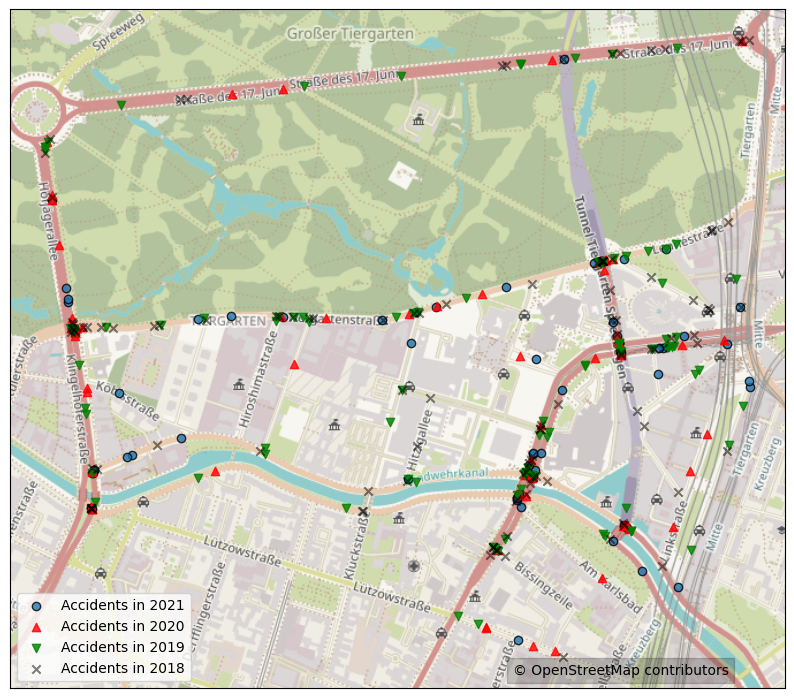

# Berlin traffic accidents vs votes
This project explores the correlation between the recent Berlin election outcome and traffic accidents and visualizes some insights using `geopandas` and `contextily`.


## Data sources
The project uses the following data sources (all under [CC BY 3.0 DE](https://creativecommons.org/licenses/by/3.0/de/)):
- Straßenverkehrsunfälle nach Unfallort in Berlin ([18](https://daten.berlin.de/datensaetze/strassenverkehrsunf%C3%A4lle-nach-unfallort-berlin-2018),[19](https://daten.berlin.de/datensaetze/strassenverkehrsunf%C3%A4lle-nach-unfallort-berlin-2018),[20](https://daten.berlin.de/datensaetze/strassenverkehrsunf%C3%A4lle-nach-unfallort-berlin-2020),[21](https://daten.berlin.de/datensaetze/stra%C3%9Fenverkehrsunf%C3%A4lle-nach-unfallort-berlin-2021)) 
- [Geometry of the election districts in Berlin](https://daten.berlin.de/datensaetze/geometrien-der-wahlbezirke-f%C3%BCr-die-wahlen-zum-deutschen-bundestag-berlin-und-zum) 
- [Repeat election to the Berlin House of Representatives results](https://download.statistik-berlin-brandenburg.de/c6fffa8361dd1404/007e994c0407/DL_BE_AGHBVV2023.xlsx)
- [Lebensweltlich orientierte Räume (LOR) - Planungsräume (seit 2021)](https://daten.odis-berlin.de/de/dataset/lor_planungsgraeume_2021/)
- [Gesundheits- und Sozialstrukturatlas Berlin 2022: Indexwerte auf Ebene der Planungsräume](https://daten.berlin.de/datensaetze/gesundheits-und-sozialstrukturatlas-berlin-2022-indexwerte-auf-ebene-der-planungsr%C3%A4ume)

OSM tile data is from [OpenStreetMap](https://www.openstreetmap.org/copyright) contributors under the [Open Database License](https://opendatacommons.org/licenses/odbl/).

# Installation/Usage
## Colab
Go to https://colab.research.google.com/github/, authorize yourself, tick "include private repos", after that your should see the notebook file(s) in this repo.

### Revision history and commiting changes
- Colab already has built-in revision history tool, it is under File->Revision history
- When some changes to notebook are made (or a new notebook file created), you can commit it to the repo using File->Save a copy in Github

## Running on local PC
I run Jupyter Notebook from Anaconda on a Windows machine, here are the steps I made:
- install git/git gui of your choice, clone the repo
- install anaconda
- from anaconda prompt, create and activate a separate enviroment:
```
conda create --name EnvName
conda activate EnvName
```
- install ipykernel to be able to run notebooks from that enviroment (all other pakages should be installed from the Notebook itself in order to be compatible with Colab):
```
conda install -c anaconda ipykernel
python -m ipykernel install --user --name=EnvName
```
- run Jupyter Notebook, don't forget to choose the right Kernel, that's it!

### Revision history
'git diff' is not very usable for .ipynb files, but one can use [nbdime](https://nbdime.readthedocs.io/en/latest/) for diffing and merging. You can install it from conda prompt:
```
conda install -c conda-forge nbdime
```
set up git integration
```
nbdime config-git --enable --global
```
Afterwards, you can use a web-based GUI to view the notebook diff, for example
```
nbdiff-web 551d6ee 4210941
```
